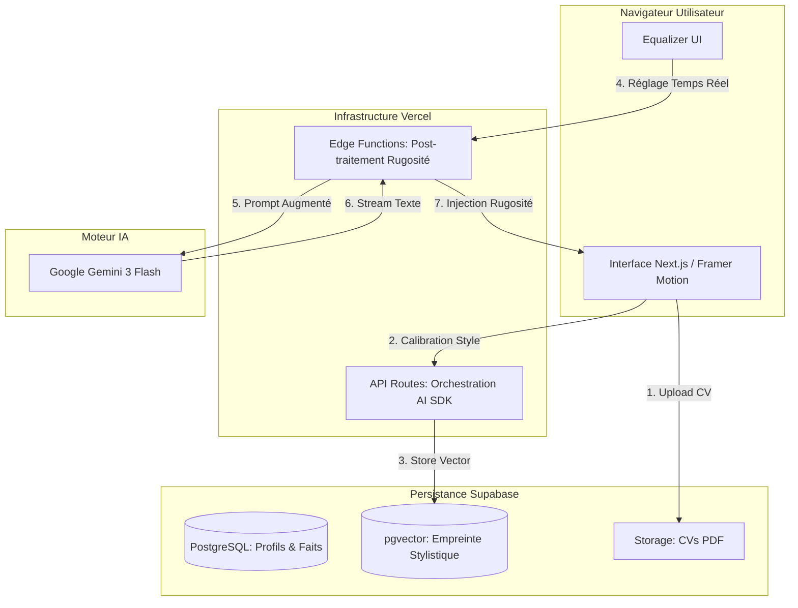

# Architecture

# 1. Stack Technologique

| **Catégorie** | **Technologie** | **Version (2026)** | **Usage** | **Rationale** |
| --- | --- | --- | --- | --- |
| **Frontend** | **Next.js** | 16.x | Interface de l'Atelier | Optimisé pour Vercel, rendu hybride (SSR/Edge). |
| **Hébergement** | **Vercel** | - | Déploiement & Edge | Latence minimale pour l'Equalizer via Edge Functions. |
| **IA (LLM)** | **Google Gemini** | **3 Flash** | Moteur de Jumeau Numérique | Excellente compréhension du contexte et rapidité de synthèse. |
| **Base de Données** | **Supabase** | (PostgreSQL) | Données & Vecteurs | SQL robuste + extension pgvector pour l'empreinte stylistique. |
| **Authentification** | **Supabase Auth** | - | Gestion des accès | Intégration native, sécurisée et rapide à implémenter. |
| **Stockage** | **Supabase Storage** | - | Stockage des CV (PDF) | Gestion simplifiée des fichiers et des permissions. |
| **Orchestration IA** | **Vercel AI SDK** | v4.x | Streaming & Tooling | Support natif de Gemini et streaming SSE simplifié. |

# 2. Diagramme de l'Architecture (High Level)

Voici comment les composants vont interagir pour créer l'expérience de l'Atelier :

codeMermaid

# 3. Schéma de Base de Données (Supabase / PostgreSQL)

## 3.1 Table : profiles

Stocke les informations d'identité et de contexte métier de l'utilisateur.

- id : uuid (Primary Key, lié à auth.users)
- email : text
- professional_domain : text (ex: "Logistique", "Développement Web")
- years_of_experience : integer
- cv_url : text (Lien vers le fichier dans Supabase Storage)
- created_at : timestamp with time zone

## 3.2 Table : identity_configs (Le Jumeau Numérique)

Stocke les réglages de l'Equalizer et l'empreinte stylistique.

- id : uuid (Primary Key)
- user_id : uuid (Foreign Key vers profiles.id)
- **Réglages Equalizer :**
    - roughness_level : float (0.0 à 1.0)
    - authority_level : float (0.0 à 1.0)
    - tone_level : float (0.0 à 1.0)
- **Vecteur d'Identité :**
    - style_embedding : vector(1536) (Utilise l'extension **pgvector**. Stocke la signature stylométrique calculée par Gemini pour des recherches de similarité).
- updated_at : timestamp with time zone

## 3.3 Table : knowledge_base (Les Faits)

Stocke les éléments factuels extraits du CV ou saisis manuellement.

- id : uuid (Primary Key)
- user_id : uuid (Foreign Key vers profiles.id)
- content : jsonb (Stocke les blocs d'expérience : { "title": "...", "company": "...", "achievements": [...] })
- source_type : text (Enum : 'pdf_cv', 'manual_entry')
- is_verified : boolean (Défini à true quand l'utilisateur valide le résumé de l'Epic 1)

## 3.4 Table : posts

L'historique des publications et les métriques de fidélité.

- id : uuid (Primary Key)
- user_id : uuid (Foreign Key vers profiles.id)
- raw_idea : text (L'entrée brute de l'utilisateur)
- generated_content : text (Le texte produit par l'IA-Miroir)
- final_content : text (Le texte après corrections utilisateur)
- fidelity_ratio : float (Calculé automatiquement : % de texte conservé)
- created_at : timestamp with time zone

# 4. Stratégie d'API et de Prompting

## 4.1 Architecture des Endpoints (Vercel Edge Functions)

Nous utiliserons le **Vercel AI SDK** pour gérer le streaming et l'orchestration des appels vers Gemini.

1. **POST /api/onboard/analyze** :
    - *Rôle :* Reçoit le texte du CV ou la saisie manuelle.
    - *Action :* Utilise Gemini pour extraire un JSON structuré des faits métier.
2. **POST /api/mirror/stream (SSE)** :
    - *Rôle :* L'endpoint de l'**Equalizer**.
    - *Action :* Reçoit les valeurs des curseurs (0.0 à 1.0) et un texte témoin. Renvoie en streaming la variation stylistique immédiate.
3. **POST /api/generate/post (SSE)** :
    - *Rôle :* Le moteur de production final.
    - *Action :* Combine l'idée brute + les faits du profil + les vecteurs d'identité pour générer le post LinkedIn "rugueux".

## 4.2 Ingénierie des Prompts (Le "System Prompt" Miroir)

Pour obtenir la **Rugosité Stylistique**, nous n'utiliserons pas un prompt simple, mais une structure en trois couches :

- **Couche 1 : L'Ancre de Personnalité (Identity Anchor)**
    
    > "Tu es le Jumeau Numérique de [Nom/Domaine]. Ton niveau d'autorité est réglé à [Value]. Ton ton est [Tone_Value]. Tu parles à partir des faits suivants uniquement : [Knowledge_Base_Context]."
    > 
- **Couche 2 : Le Filtre de Rugosité (The De-Smoothing Filter)**
    
    > "CRITIQUE : Évite absolument le style 'Assistant IA'. Ne commence jamais par 'Dans le monde d'aujourd'hui' ou 'Il est important de'. Utilise des phrases de longueurs inégales. Intègre des silences, des hésitations ou des formulations directes. Si le curseur Rugosité est à [High], privilégie le langage parlé et les observations brutes de terrain."
    > 
- **Couche 3 : La Contrainte LinkedIn (Platform Guardrail)**
    
    > "Formate le contenu pour LinkedIn : accroche percutante, aération maximale, pas de hashtags génériques en excès. Le texte doit passer le test de l'intuition humaine : on doit croire que c'est l'auteur qui a tapé cela sur son téléphone dans un moment de réflexion."
    > 

## 4.3 Optimisation Gemini 3 Flash

Nous exploiterons la fonction de **"System Instructions"** native de Gemini pour figer le jumeau numérique au niveau du modèle, ce qui réduit la latence et la consommation de tokens à chaque mouvement de l'Equalizer.

# 5. **Arborescence du Projet (Source Tree)**

postry-ai/
├── apps/
│   └── web/                        # Application principale Next.js
│       ├── src/
│       │   ├── app/                # Next.js App Router
│       │   │   ├── (auth)/         # Routes d'authentification (login, register)
│       │   │   ├── (atelier)/      # Routes de l'application (dashboard, tuner, editor)
│       │   │   └── api/            # API Routes
│       │   │       ├── chat/       # Endpoint Vercel AI SDK pour Gemini
│       │   │       ├── onboard/    # Parsing CV et extraction de faits
│       │   │       └── mirror/     # Endpoint temps réel pour l'Equalizer (SSE)
│       │   ├── components/         # Composants React
│       │   │   ├── ui/             # Composants de base (Shadcn/UI modifiés)
│       │   │   ├── atelier/        # Composants spécifiques à la saisie d'idées
│       │   │   ├── tuner/          # Composants de l'Equalizer (IdentitySlider)
│       │   │   └── shared/         # Layouts, Navigation, Footer
│       │   ├── hooks/              # Hooks personnalisés (useMirror, useFidelity)
│       │   ├── lib/                # Configurations (gemini.ts, supabase.ts)
│       │   ├── services/           # Logique métier (ai-service.ts, profile-service.ts)
│       │   └── styles/             # Global CSS et thèmes Tailwind
│       └── next.config.js
├── packages/
│   ├── database/                   # Gestion Supabase
│   │   ├── migrations/             # Fichiers .sql (pgvector, RLS, Tables)
│   │   ├── seed/                   # Données initiales pour les tests de rugosité
│   │   └── types.ts                # Types générés automatiquement par Supabase CLI
│   ├── shared-types/               # Types TypeScript partagés (Frontend/Backend/AI)
│   │   └── index.ts                # Interfaces Jumeau, Post, IdentityVector
│   └── ai-engine/                  # (Optionnel) Logique de dé-lissage isolée
│       ├── prompts/                # Templates de prompts (Ancre, Rugosité, LinkedIn)
│       └── utils/                  # Algorithmes de post-traitement stylistique
├── docs/                           # Tous les documents de planification
├── package.json                    # Workspaces pnpm/npm
└── turbo.json                      # Orchestration Turborepo

# 6. Infrastructure et Déploiement

## 6.1 Environnements et Pipeline CI/CD

Nous utiliserons l'intégration native entre **GitHub** et **Vercel** pour une vélocité maximale.

- **Environnements :**
    - Development : Branche dev, liée à un projet Supabase de test.
    - Preview : Généré automatiquement pour chaque Pull Request (permet à Sally de valider l'UX avant le merge).
    - Production : Branche main, liée au projet Supabase de production.
- **Pipeline CI/CD :**
    1. **Lint & Test :** Validation du code (ESLint) et des tests unitaires (Vitest).
    2. **Architecture Check :** Vérification de la conformité du schéma Supabase via la CLI.
    3. **Deploy :** Déploiement atomique sur Vercel (Frontend + Edge Functions).

## 6.2 Sécurité et Gestion des Secrets

- **Secrets :** Toutes les clés (Gemini API, Supabase Service Role) sont stockées dans les variables d'environnement chiffrées de Vercel.
- **Protection des Données :**
    - Chiffrement au repos (AES-256) via Supabase.
    - Chiffrement en transit (TLS 1.3).
    - **Isolation IA :** Utilisation de l'API Gemini via Vertex AI (Google Cloud) pour garantir que les données ne sont pas utilisées pour l'entraînement public des modèles (Conformité Entreprise).

## 6.3 Observabilité et Maintenance

- **Monitoring :** **Sentry** pour la capture des erreurs frontend/backend et **Vercel Analytics** pour la mesure de la latence de l'Equalizer.
- **Logs IA :** Utilisation de **LangSmith** ou d'un outil équivalent pour auditer la qualité des prompts et le coût des tokens en temps réel.
- **Stratégie de Rollback :** Vercel permet un retour instantané à la version précédente en cas de bug sur l'algorithme de "dé-lissage".

### 7. Coding Standards (MANDATOIRES pour l'IA)

Ces règles visent à garantir un code propre, typé et performant sur Vercel et Supabase.

### 7.1 Langages et Frameworks

- **TypeScript 5.x+ :** Typage strict obligatoire (strict: true). Aucun type any n'est autorisé.
- **Next.js 16 (App Router) :** Utiliser les *Server Components* par défaut. N'utiliser 'use client' que lorsque l'interactivité (Framer Motion, formulaires) le nécessite.
- **Tailwind CSS 4 :** Utiliser exclusivement les classes utilitaires pour le styling. Pas de CSS-in-JS ou de fichiers CSS séparés (sauf pour les variables globales).

### 7.2 Conventions de Nommage

- **Composants React :** PascalCase (ex: IdentitySlider.tsx).
- **Fichiers et Dossiers :** kebab-case (ex: ai-service.ts, use-mirror.ts).
- **Fonctions et Variables :** camelCase.
- **Tables et Colonnes Supabase :** snake_case (ex: identity_configs).

### 7.3 Patterns de Développement (Crucial pour postry.ai)

- **Gestion de l'IA :** Utiliser exclusivement le **Vercel AI SDK** pour les appels Gemini. Les prompts doivent être isolés dans le dossier packages/ai-engine/prompts.
- **Accès aux Données :** Toujours utiliser le client Supabase avec la gestion des types générés. Ne jamais bypasser la **RLS (Row Level Security)**.
- **Gestion d'État :** Privilégier les hooks React (useState, useReducer) et les URL (via next/navigation) pour l'état de l'Atelier. Éviter les bibliothèques lourdes type Redux.
- **Animations :** Utiliser **Framer Motion** pour toutes les transitions liées au morphing de texte.

### 7.4 Règles Critiques d'Anti-Erreur IA

- **Zéro Console :** Ne jamais utiliser console.log en production. Utiliser un utilitaire de logging si nécessaire.
- **Commentaires JSDoc :** Chaque fonction complexe (notamment l'algorithme de dé-lissage) doit être documentée avec JSDoc pour expliquer sa logique.
- **Tests :** Chaque nouveau composant UI doit avoir un fichier de test Vitest associé dans le même dossier.

# 8. Résultats de la Checklist Architecte

J'ai passé l'ensemble de cette architecture au crible de mes standards d'excellence :

- **Performance :** **PASS** (Gemini 3 Flash + Edge Functions garantissent une réactivité extrême).
- **Scalabilité :** **PASS** (Architecture 100% Serverless).
- **Sécurité :** **PASS** (Isolation des jumeaux via RLS et isolation des données via Vertex AI).
- **Adéquation MVP :** **PASS** (Stack moderne mais simple à maintenir).