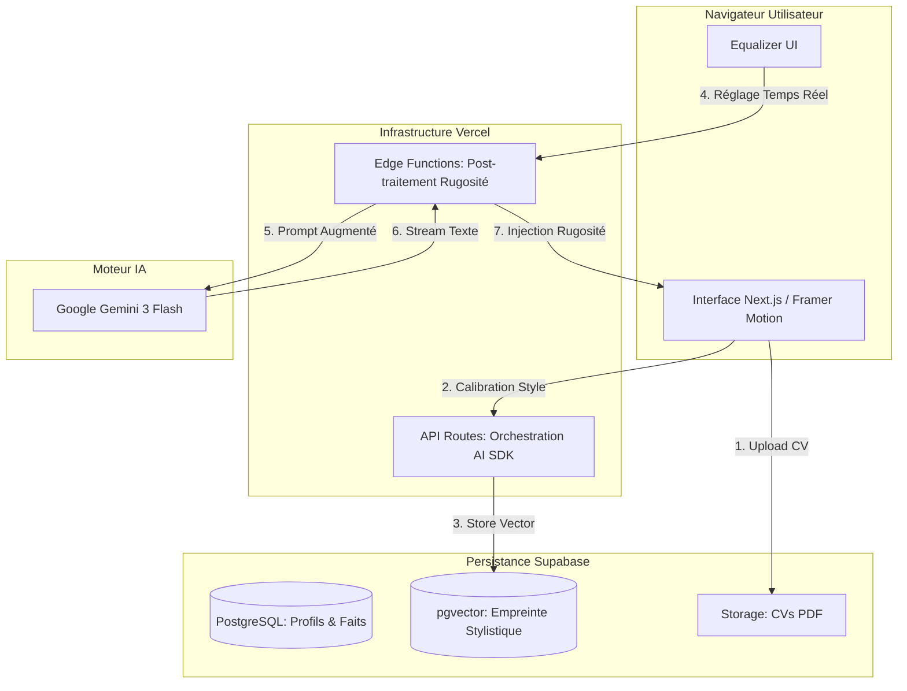

# Diagramme de l'Architecture (High Level)

Voici comment les composants vont interagir pour créer l'expérience de l'Atelier :

```mermaid
graph TD
    subgraph Client [Navigateur Utilisateur]
        UI[Interface Next.js / Framer Motion]
        EQ[Equalizer UI]
    end

    subgraph Vercel [Infrastructure Vercel]
        Edge[Edge Functions: Post-traitement Rugosité]
        API[API Routes: Orchestration AI SDK]
    end

    subgraph AI_Engine [Moteur IA]
        Gemini[Google Gemini 3 Flash]
    end

    subgraph Data [Persistance Supabase]
        DB[(PostgreSQL: Profils & Faits)]
        Vec[(pgvector: Empreinte Stylistique)]
        Store[Storage: CVs PDF]
    end

    %% Flux de données
    UI -->|1. Upload CV| Store
    UI -->|2. Calibration Style| API
    API -->|3. Store Vector| Vec
    EQ -->|4. Réglage Temps Réel| Edge
    Edge -->|5. Prompt Augmenté| Gemini
    Gemini -->|6. Stream Texte| Edge
    Edge -->|7. Injection Rugosité| UI
```
