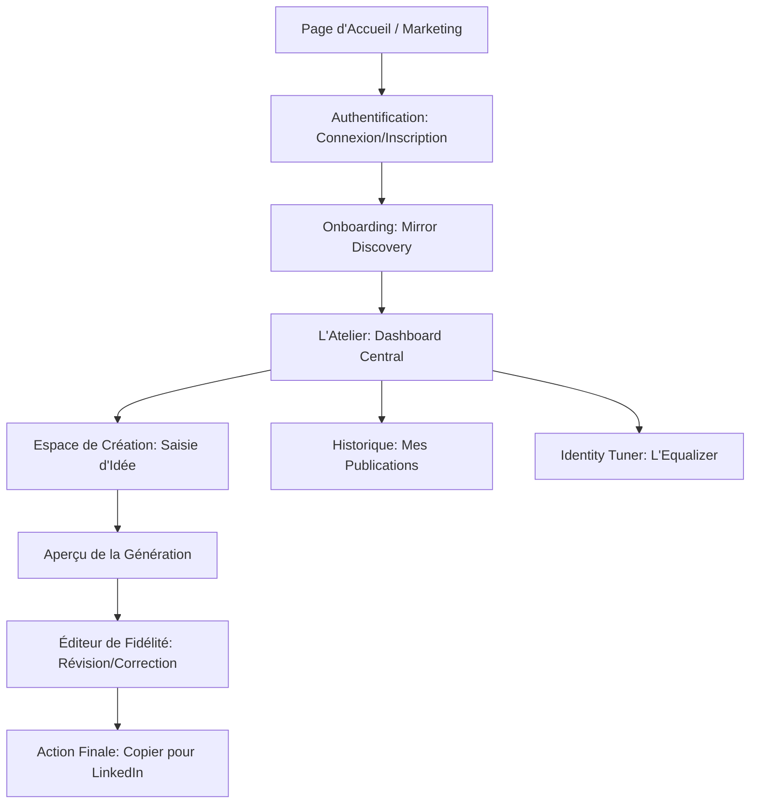
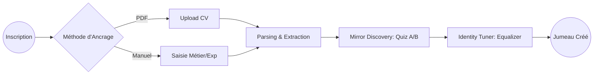
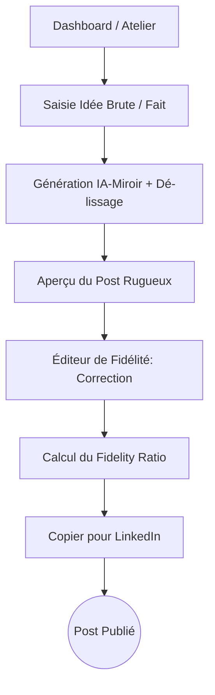

# Spécifications UI/UX

# Étape 1 : Objectifs UX et Principes de Design

Basé sur notre PRD, voici ma proposition pour les fondations de l'expérience **postry.ai** :

## 1.1 Personas Cibles (Rappel)

- **L'Expert Technique Silencieux :** Besoin de clarté, de précision et de ne pas se sentir "vendeur".
- **Le Solopreneur en Quête de Confiance :** Besoin de rapidité et d'un ton qui rassure ses clients.
- **Le Chercheur d'Emploi Invisible :** Besoin d'humanité et de simplicité pour lever l'angoisse de la page blanche.

## 1.2 Objectifs d'Usabilité

- **Onboarding "Zéro Friction" :** L'utilisateur doit avoir défini son jumeau numérique en moins de 2 minutes de manière ludique.
- **Contrôle Tactile (L'Equalizer) :** Le réglage du style doit être intuitif et gratifiant. L'utilisateur doit "sentir" l'impact de ses réglages immédiatement.
- **Transparence de l'IA :** L'interface doit clairement montrer ce qui vient de l'IA et ce qui vient de l'humain (notamment dans l'Éditeur de Fidélité).

## 1.3 Principes de Design

1. **L'Esthétique de l'Atelier :** Utiliser des éléments visuels qui évoquent la création artisanale (textures subtiles, papiers, typographies serif pour le contenu).
2. **La Rugosité Visuelle :** Ne pas chercher la perfection symétrique. Utiliser des espacements généreux et des contrastes forts pour souligner l'authenticité.
3. **Feedback Immédiat :** Chaque action (notamment sur l'Equalizer) doit avoir une réaction visuelle instantanée pour renforcer le sentiment de maîtrise.

# 2. Architecture de l'Information (Sitemap)

Pour un "Atelier de Sculpture" numérique, la structure doit être à la fois simple et centrée sur l'outil de création.

## 2.1 Plan du Site (Sitemap)

codeMermaid

## 2.2 Structure de Navigation

- **Navigation Principale (Barre latérale "L'Établi") :**
    - **Atelier :** Accès direct à la création de post.
    - **Identité :** Accès permanent à l'Equalizer pour ajuster son jumeau.
    - **Archives :** Consultation des anciens posts et des scores de fidélité.
- **Navigation Secondaire (Profil) :**
    - Paramètres du compte, Importation de CV (si non faite à l'onboarding), Déconnexion.
- **Stratégie de Fil d'Ariane :**
    - Utilisée principalement lors du flux de création (Idée > Génération > Édition) pour permettre à l'utilisateur de revenir en arrière sans perdre son contexte.

# 3. Flux Utilisateurs (User Flows)

## 3.1 Flux A : Onboarding et Calibration du Jumeau (Mirror Discovery)

**Objectif :** Transformer un nouvel utilisateur en un auteur "calibré" en moins de 2 minutes.

codeMermaid

- **Points d'Entrée :** Inscription terminée.
- **Critères de Succès :** Profil stylistique enregistré et base de connaissances factuelle créée.
- **Cas d'Erreur :**
    - *PDF illisible :* Redirection douce vers la saisie manuelle.
    - *Abandon du quiz :* Sauvegarde de l'état actuel pour reprise ultérieure.

## 3.2 Flux B : Le Cycle de Création "Trace Humaine"

**Objectif :** Passer d'une idée brute à un post LinkedIn authentique.

codeMermaid

- **Points d'Entrée :** Dashboard central ("L'Établi").
- **Critères de Succès :** Texte copié dans le presse-papier et score de fidélité enregistré.
- **Cas d'Erreur :**
    - *Idée trop vague :* L'IA demande une précision ou propose un angle d'attaque.
    - *Résultat non satisfaisant :* Possibilité d'ajuster l'Equalizer directement depuis la preview (accès rapide).

# 4. Wireframes et Maquettes (Layouts Conceptuels)

## 4.1 Identité Visuelle et Ambiance (Mood)

- **Palette de Couleurs :** Neutres chauds (papier crème, gris argile), texte anthracite profond, et une couleur d'accent "Encre" (bleu nuit ou terre d'ombre) pour les actions principales.
- **Typographie :**
    - *Interface :* Sans-serif moderne et lisible (type Inter) pour les menus.
    - *Contenu (Le Post) :* Une Serif de caractère (type Playfair Display ou EB Garamond) pour donner une sensation d'écrit humain et noble.
- **Style :** Minimalisme organique. Utilisation de bordures douces, d'ombres portées légères et de transitions fluides.

## 4.2 Agencement des Écrans Clés

**Écran 1 : Le Portail "Mirror Discovery" (Onboarding)**

- **Layout :** Centralisé, focus total sur le choix.
- **Éléments :** Deux grandes "cartes" côte à côte. Chaque carte contient le même fait métier mais écrit différemment (ex: une version directe, une version imagée).
- **Interaction :** "Choisissez le texte qui vous ressemble le plus". Un indicateur de progression en bas (1/5).

**Écran 2 : L'Atelier (Le Dashboard de Création)**

- **Layout :** Épuré, type "Zen Mode".
- **Haut de page :** Rappel de votre domaine métier (ex: "Expert en Logistique").
- **Zone Centrale :** Un champ de saisie large et aéré. "Une idée ? Un souvenir ? Jetez vos notes ici..."
- **Bas de page :** Bouton flottant "Révéler mon reflet" (Générer).

**Écran 3 : Le Studio de l'Identité (L'Equalizer)**

- **Layout :** Panneau latéral (Sidebar) ou vue dédiée avec prévisualisation.
- **Gauche (Les Outils) :** Une série de curseurs verticaux élégants.
    - *Rugosité :* De "Lisse/Robotique" à "Brut/Spontané".
    - *Autorité :* De "Humble/Apprenti" à "Expert/Leader".
    - *Ton :* De "Sérieux/Académique" à "Sarcastique/Vif".
- **Droite (Le Miroir) :** Un bloc de texte témoin qui se transforme visuellement (morphing) dès que l'on touche à un curseur.

**Écran 4 : L'Éditeur de Fidélité**

- **Layout :** Vue "Focus" sur le texte généré.
- **Fonctionnalité :** Le texte généré par l'IA apparaît. Dès que l'utilisateur clique pour modifier, les changements sont mis en évidence (soulignage discret).
- **Métrique :** Un petit compteur de "Fidélité" en temps réel dans un coin (ex: "92% fidèle à votre jumeau").
- **Action Finale :** Un bouton proéminent "Copier pour LinkedIn".

# 5. Bibliothèque de Composants (Component Library)

## 5.1 Approche du Design System

Nous utiliserons une base solide (type **Radix UI** ou **Shadcn/UI**) pour l'accessibilité, mais nous appliquerons une couche de personnalisation "Atelier" (Custom Theme) pour transformer les composants standards en outils de sculpture.

## 5.2 Composants Cœurs (Core Components)

| **Composant** | **Rôle & Usage** | **États & Variantes** |
| --- | --- | --- |
| **MirrorCard** | Utilisé dans le quiz *Mirror Discovery*. Présente un texte A ou B. | Normal, Sélectionné, Survolé. |
| **IdentitySlider** | Le curseur de l'Equalizer. Plus large et tactile que la normale. | Actif, Désactivé, En cours de réglage (Feedback visuel). |
| **AtelierInput** | Zone de saisie de l'idée brute. Pas de bordures, juste un soulignage léger. | Vide, Saisie, Focus (Zen mode). |
| **TraceEditor** | L'éditeur de texte final qui suit les modifications utilisateur. | Lecture, Édition, Comparaison (Mode Diff). |
| **FidelityMeter** | Indicateur circulaire ou barre de progression du score de fidélité. | Bas (<50%), Moyen (50-80%), Haut (>80%). |
| **ActionInkButton** | Bouton principal (Copier/Publier) avec une texture d'encre. | Primaire, Secondaire, Chargement (Génération IA). |

## 5.3 Focus sur l'IdentitySlider (L'outil maître)

C'est le composant le plus important. Il doit avoir :

- **Un libellé clair :** ex: "Rugosité".
- **Des bornes sémantiques :** ex: "Lisse" à gauche, "Brut" à droite.
- **Une réponse visuelle :** Une animation légère sur le texte témoin à chaque cran du curseur.

# 6. Accessibilité et Responsivité

## 6.1 Accessibilité (Inclusion par le Design)

- **Cible de Conformité :** **WCAG 2.1 Niveau AA**.
- **Contraste et Lisibilité :**
    - Utilisation de ratios de contraste élevés (minimum 4.5:1) pour tous les textes.
    - La typographie Serif pour les posts doit être testée pour rester lisible même en petite taille ou pour les utilisateurs dyslexiques.
- **Navigation au Clavier :**
    - L'Equalizer doit être entièrement pilotable via les touches fléchées (incrémentation de 5% par pression).
    - Gestion rigoureuse du "Focus" visuel pour que l'utilisateur sache toujours quel curseur il manipule.
- **Lecteurs d'Écran (ARIA) :**
    - Utilisation de labels explicites pour les curseurs (ex: aria-label="Régler le niveau de rugosité stylistique").
    - Annonce vocale des changements de texte dans l'aperçu en temps réel pour que les utilisateurs non-voyants puissent "entendre" l'évolution du ton.

## 6.2 Stratégie de Responsivité (Adaptation des Outils)

| **Breakpoint** | **Largeur** | **Adaptation de l'Atelier** |
| --- | --- | --- |
| **Mobile** | < 768px | **Mode "Zen" Prioritaire.** L'Equalizer devient un panneau escamotable (Bottom Sheet). Le quiz *Mirror Discovery* s'affiche en une seule carte à swiper (type Tinder). |
| **Tablet** | 768px - 1024px | **Layout Hybride.** L'Equalizer s'affiche en haut de la zone de saisie. Utilisation des gestes tactiles pour les curseurs. |
| **Desktop** | > 1024px | **L'Atelier Complet.** Navigation latérale fixe. Equalizer et Zone de saisie côte à côte pour un feedback visuel instantané. |

## 6.3 Patterns d'Adaptation Clés

- **Saisie Mobile :** Optimisation du clavier virtuel pour ne pas masquer la zone de saisie de l'idée brute.
- **L'Equalizer Tactile :** Sur mobile, les zones de contact des curseurs sont élargies (minimum 44x44 pixels) pour éviter les erreurs de manipulation.

# 7. Animation et Micro-interactions

## 7.1 Principes de Mouvement

- **Mouvement Organique :** Pas d'animations linéaires ou robotiques. Nous utiliserons des courbes d'accélération (easings) douces qui évoquent le mouvement de la main ou de l'encre.
- **Réponse Tactile (Weighted Motion) :** Les curseurs de l'Equalizer doivent avoir une sensation de "poids". Une légère résistance visuelle lorsqu'on atteint les extrêmes renforce le sentiment de manipuler une identité réelle.
- **Continuité Identitaire :** Les transitions entre les écrans (ex: de l'Onboarding à l'Atelier) doivent être fluides, comme si on ouvrait une porte dans une pièce, pour ne pas briser l'immersion du jumeau numérique.

## 7.2 Micro-interactions Clés

| **Interaction** | **Effet Visuel** | **Objectif UX** |
| --- | --- | --- |
| **Le Morphing de Style** | Lorsque l'utilisateur bouge un curseur de l'Equalizer, les mots du texte témoin ne changent pas brusquement ; ils semblent se "réorganiser" ou changer de graisse subtilement. | Montrer que l'identité est une matière vivante que l'on sculpte. |
| **L'Apparition "Encre"** | Lors de la génération du post, au lieu d'un spinner classique, le texte apparaît par un effet de diffusion progressive (comme de l'encre sur du papier). | Renforcer l'esthétique de l'Atelier et réduire la perception de l'attente. |
| **Le Glow de Fidélité** | Quand l'utilisateur modifie le texte, le compteur de fidélité réagit par une pulsation douce. S'il dépasse 80%, une lueur discrète entoure l'éditeur. | Valoriser l'adéquation entre l'humain et son jumeau. |
| **Validation "Trace"** | Lors du clic sur "Copier pour LinkedIn", une animation de "tampon" ou de signature confirme l'action. | Marquer la fin du travail de l'artisan avec satisfaction. |

## 7.3 Performance et Accessibilité des Animations

- **Respect des Préférences :** Si l'utilisateur a activé l'option "Réduire les animations" dans son système, nous supprimerons les effets de morphing complexes pour ne garder que les changements d'états essentiels.
- **Légèreté :** Toutes les animations seront réalisées en CSS ou via des bibliothèques légères (type Framer Motion) pour ne pas impacter le temps de chargement de 180s défini par John.

# 8. Considérations de Performance (UX)

La perception de la vitesse est un facteur clé de la confiance. Si l'IA est lente, l'utilisateur doit au moins sentir que l'interface, elle, est instantanée.

## 8.1 Objectifs de Performance Visuelle

- **Temps de Chargement Initial :** < 2 secondes pour afficher l'Atelier (L'établi doit être prêt immédiatement).
- **Réactivité de l'Equalizer :** < 100ms pour la réponse visuelle du curseur ; < 500ms pour le début du morphing du texte.
- **Fluidité des Animations :** Stable à 60 FPS, même lors des transitions complexes.

## 8.2 Stratégies de Design pour la Performance

- **Skeleton Screens "Atelier" :** Utilisation de tracés légers évoquant un dessin technique pendant le chargement des données du CV ou de la génération IA.
- **Optimistic UI :** Sauvegarde immédiate des réglages de l'Equalizer en local avant confirmation du serveur, pour une sensation de latence zéro.
- **Chargement Progressif :** Priorité à l'affichage de la zone de saisie et de l'Equalizer, les archives et éléments secondaires sont chargés en arrière-plan.

---

# 9. Prochaines Étapes et Validation

## 9.1 Actions Immédiates

1. **Revue de Design :** Valider ces spécifications avec les parties prenantes.
2. **Maquettes Haute Fidélité :** Créer les visuels finaux dans Figma en intégrant les textures et typographies choisies.
3. **Handoff Technique :** Transmettre ce document à Winston (Architecte) pour qu'il conçoive l'infrastructure capable de supporter le temps réel et le morphing.

## 9.2 Checklist de Remise au Design Architect

Tous les flux utilisateurs sont documentés (Onboarding & Création).

L'inventaire des composants cœurs est terminé.

Les exigences d'accessibilité (WCAG AA) sont définies.

La stratégie de responsivité est claire.

Les principes d'animation et de micro-interactions sont posés.

---

## 10. Résultats de la Checklist UX/UI

En tant qu'experte UX, j'ai passé cette spécification au crible de nos standards de qualité.

- **Cohérence Identitaire :** 100% (Le concept d'Atelier est infusé dans chaque écran).
- **Réduction de Friction :** Excellente (L'onboarding gamifié et l'Equalizer simplifient radicalement l'usage de l'IA).
- **Faisabilité UX :** Validée (L'utilisation de bibliothèques standards avec une couche de style personnalisée permet un développement rapide).